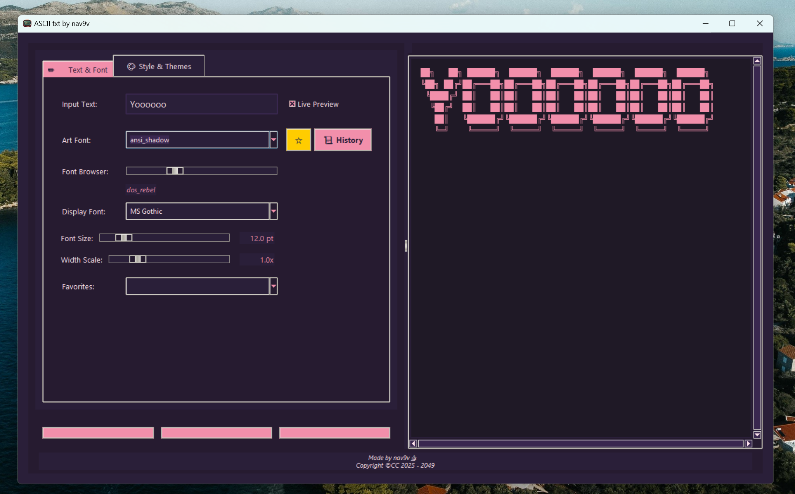
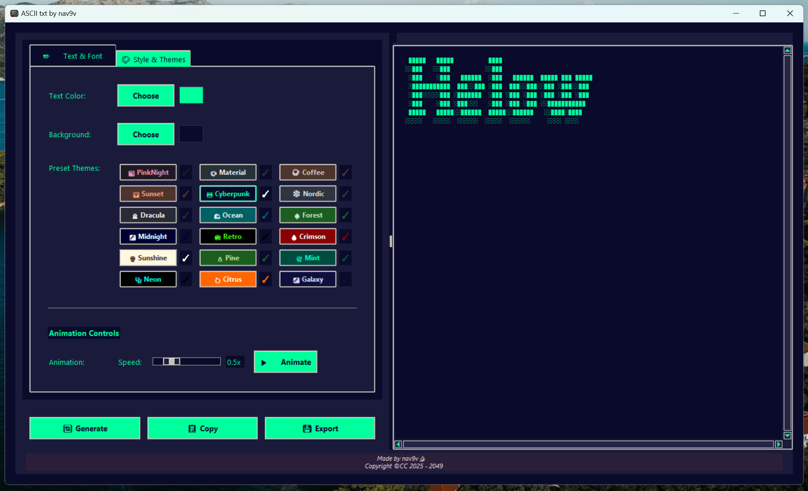

# ASCII txt by nav9v

A feature-rich ASCII art generator with a modern interface and customization options.



---




## What is this?

ASCII txt is a desktop application that transforms your text into stylized ASCII art. Whether you want to create eye-catching console messages, add flair to your comments, or just have fun with text art, this tool makes it easy!

## Features

- **50+ ASCII Art Fonts**: Choose from a wide variety of text styles
- **Custom Themes**: 15+ built-in themes including Cyberpunk, Dracula, Retro and more
- **Live Preview**: See your ASCII art update in real-time as you type
- **Font Controls**: Adjust size, width and display font
- **Favorites System**: Save your favorite fonts for quick access
- **Animation Effects**: Add dynamic transitions to your ASCII art
- **Export Options**: Copy to clipboard or save as text files

## Installation

### Option 1: Download the executable
1. Go to [Releases](https://github.com/nav9v/nav-ashii/releases)
2. Download the latest `.exe` file
3. Run it directly - no installation needed!

### Option 2: Run from source
```bash
# Clone the repository
git clone https://github.com/nav9v/nav-ashii.git

# Navigate to the project folder
cd nav-ashii

# Install requirements
pip install -r requirements.txt

# Run the application
python ascii_art_generator.py
```

## How to Use

1. Type your text in the input field
2. Select a font style from the dropdown or use the slider to browse
3. Adjust the font size and width as needed
4. Choose a theme or customize colors manually
5. Click "Generate" (or enjoy the live preview)
6. Use "Copy" to copy to clipboard or "Export" to save as a text file

## Keyboard Shortcuts

- **Ctrl+N**: Cycle through themes
- **Ctrl+Up/Down**: Browse through fonts
- **Alt+Up/Down**: Adjust font size
- **Ctrl+Shift+Up/Down**: Adjust width scale

## Contributing

Feel free to fork this project and submit pull requests! You can also open issues for bugs or feature requests.

## License

This project is licensed under CC (Creative Commons) - see the LICENSE file for details.

## About

Made with ❤️ by [nav9v](https://github.com/nav9v/)